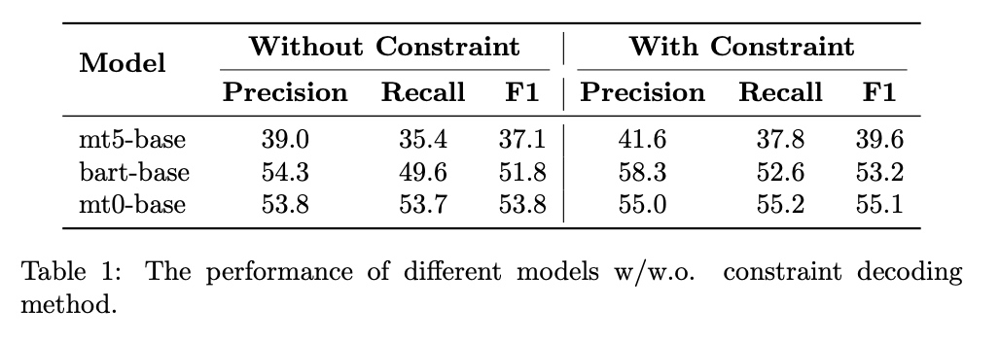

# Tourism Dialogue Parsing Tool

## Introduction
Toursim dialogue system not only needs to chat 
with the user and but also understand and extract 
the entities from dialogues for making travel 
plan.
This repository provides a tool to 
automatically extract the entities critical to 
making travel plan such as the travel 
destination and activities.


## Tool Usage
We provide an web page to interact with the 
entity extraction model. 
To use this interface, you need clone this 
repository
```shell
git clone git@github.com:ZVengin/TourismDialogue.git
```
Then start the web page server with the 
following command.
```shell
bash run_server.sh
```
The web page could be accessed with the link
```shell
http://127.0.0.1:9200
```

In addition, we also provide script to extract 
entities in a command line. To extract 
entities from your own data, you could replace 
the test file with your own in `test_seq2seq3` of 
`run.sh` and run the following command.
```shell
bash run.sh test
```


To train the model, you 
need prepare the dataset by splitting the 
dataset into train, dev, and test set.
```shell
bash run.sh split_dataset
```
Then run the `extract2.py` script to generate 
the training instances.
```shell
cd dataset
bash run.sh create_dataset
```
Finally train the model by running the `train.py`
```shell
bash run.sh train
```

To train the model on customized dataset,
you need prepare the dataset in the following 
format. each utterance within the dialogue 
should be like
```json
{
  "utterance": "えーとー、ちょっと紅葉が綺麗な所に行きたいんですけども。",
  "speaker": "customer",
  "annotation": [{
    "query": {
      "大ジャンル": "遊ぶ",
      "キーワード": "紅葉"
    }
  }]
}
```

## Performance
The performance of the model is evaluated on the 
held out test set of the toruism dialogue 
dataset. Three foundation models are evaluated 
and two different decoding strategies are tested.
The results are exhibited in the following 
table.

##